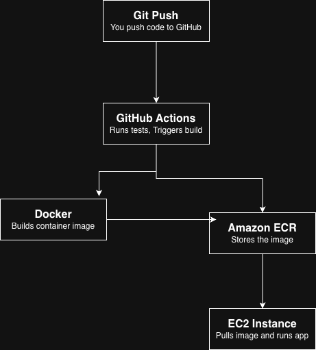

# Automated CI/CD Pipeline on AWS

A fully automated deployment pipeline that builds, tests, and deploys a Python web app 
to AWS on every push to GitHub. No manual deployment needed.

🌐 **Live app:** http://51.20.107.78:5000/

---

## What it does

Every time code is pushed to the `main` branch, the pipeline automatically:

1. Runs unit tests to make sure nothing is broken
2. Builds a Docker container from the app
3. Pushes the container image to Amazon ECR
4. SSHes into the EC2 server and deploys the latest image live

Zero manual steps after pushing code.

---

## Architecture



| Tool | Purpose |
|---|---|
| GitHub Actions | Orchestrates the entire pipeline |
| Docker | Packages the app into a container |
| Amazon ECR | Stores the Docker image |
| Amazon EC2 | Runs the live application |
| Flask | Lightweight Python web framework |

---

## Pipeline steps

```yaml
Push to main → Run tests → Build Docker image → Push to ECR → Deploy to EC2
```

---

## What I learned

- How to write a GitHub Actions workflow from scratch
- How to containerise a Python app with Docker
- How to store and pull Docker images from Amazon ECR
- How to automatically deploy to a live EC2 server via SSH
- How to debug a real CI/CD pipeline (CORS, missing credentials, security groups)

---

## How to run locally

```bash
git clone https://github.com/baabashinelle/cicd-pipeline-aws
cd cicd-pipeline-aws
pip install -r requirements.txt
python app.py
```

Visit `http://localhost:5000`

---

## How to deploy your own

1. Create an ECR repository on AWS
2. Launch an EC2 instance (Ubuntu, t2.micro)
3. Install Docker and AWS CLI on the EC2
4. Add these GitHub secrets to your repo:
   - `AWS_ACCESS_KEY_ID`
   - `AWS_SECRET_ACCESS_KEY`
   - `ECR_URI`
   - `EC2_HOST`
   - `EC2_SSH_KEY`
5. Push to `main` — the pipeline does the rest

---

